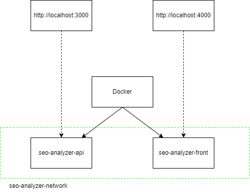

<div align="center">
<h1>SEO Analyzer 🔍</h1>
</div>

This project allows you to insert a URL and check the main SEO tips and the performance.


## Quick start
1. Build an API image
```bash
    cd front
    docker build -t seo-analyzer-api .
```

2. Build a front image
```bash
    cd front
    docker build -t seo-analyzer-front .
```

3. Wake up both images with the Docker compose
```bash
    docker compose up -d
```

## Development
You can find specifi instructions for each part.

[API](/api/README.md)

[Front](/front/README.md)


## Usage

Once the application are running, you can access the frontend interface in your web browser typically [http://localhost:4000](http://localhost:4000)

Insert a URL that you want to analyze and wait for the results.


## What problem does this project solve?
I needed a simple way to test the main SEO tips in my websites. I know there are a lot of tools to make it but i wanted specific items. 

Most of tools have too much informations and it's complex to understand. Besides, the most intersting sites are too much expensive.

Finally, it helps to me to practise and grow my portfolio.

## Tech Stack
<p float="left">


</p>

### Why this stack?
- __React__: is a very powerful library and quick to develop.
- __Vite__:  has a high performance compared to CRA
- __TypeScript__: builds stronger and more secure code than JavaScript.
- __CSS__: i don't like too much the style frameworks. For this project I wanted custom styles and this is the best and quickest way for me.
- __Express__: this project is too small and don't need authentications, authorizations, policies, caching... It has build for practising purposes and Express is a very easy way to do that.
- __Puppeteer__: I never had tested this tool and was a good moment.
- __Docker__:  To deploy it easily.

## Architecture
Maybe i could have built this project only with a React app, but i need to scrape the website to extract all the information. I thinked in use a third-party plattform to make it but it makes my project dependant of others.



